# Archimed Full Stack Developer Case Study

## Demo Video
https://www.loom.com/share/f63061ff2fac40e696f2007c3c62784f?sid=44fe4ce8-879e-4c71-93c0-28ff96e6105d
Here's a quick demo video that goes through the main features of the developed platform.

## Overview

This project is designed to automate the process of sending capital call invoices to investors for ARCHIMED, a healthcare private equity company. The project consists of a React frontend, a Django backend, and a PostgreSQL database. The main features include managing investors, generating bills, and creating capital calls based on specific business rules.

## Technologies Used

- **Frontend:** React with TailwindCSS for styling.
- **Backend:** Django REST Framework.
- **Database:** PostgreSQL.

## Data Structure

Here's a UML Class diagram that represents how the different entities of our system interact with each other.

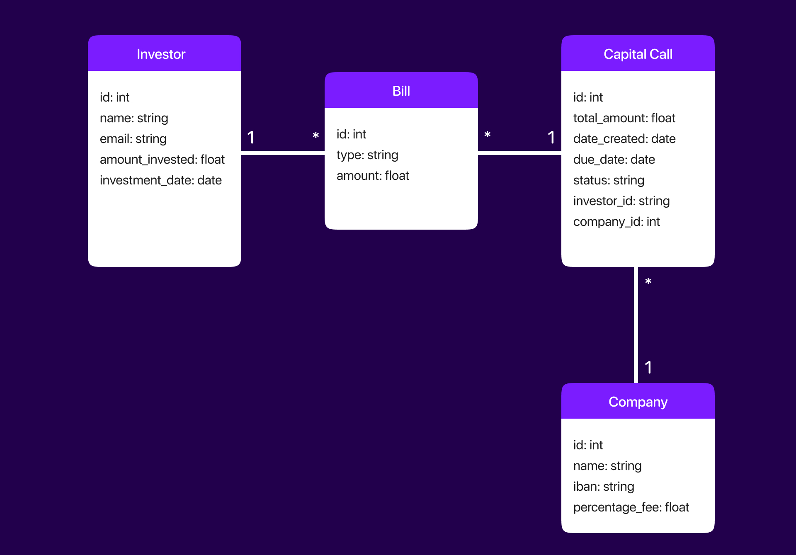

## Screenshots

### Investors interface

First, start by creating Investors. We already have some investors in our database but let's create a new one anyways.
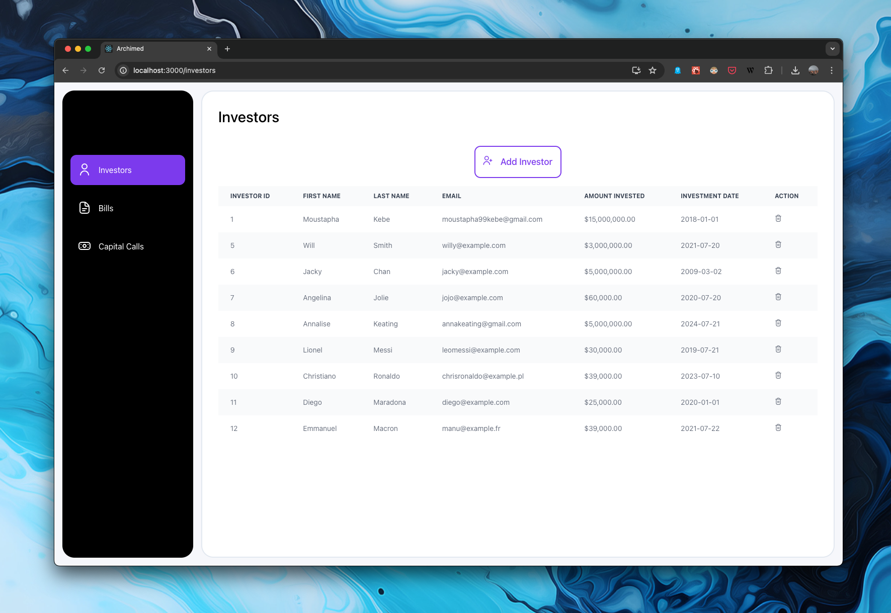
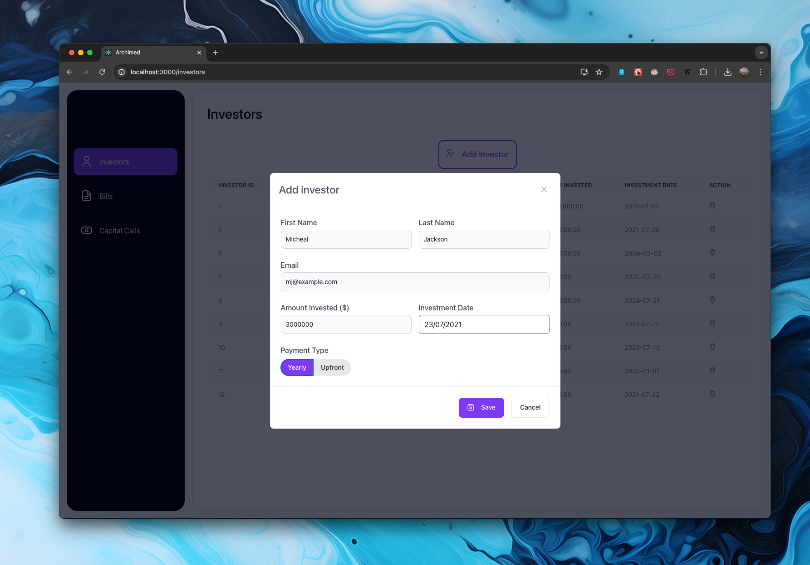
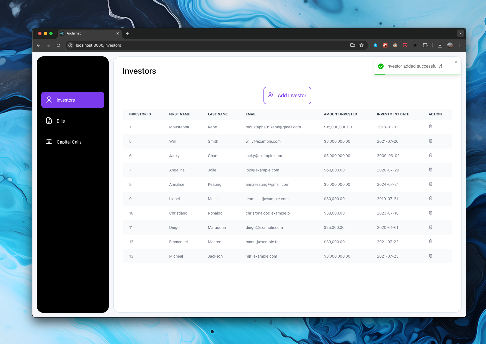

### Bills Page

The bills page generates automatically the necessary bills for every investor. But before that, we have to set up some general company information, including the fee_percentage we use to calculate the bills amounts and also the IBAN that is going to be linked to our capital calls.
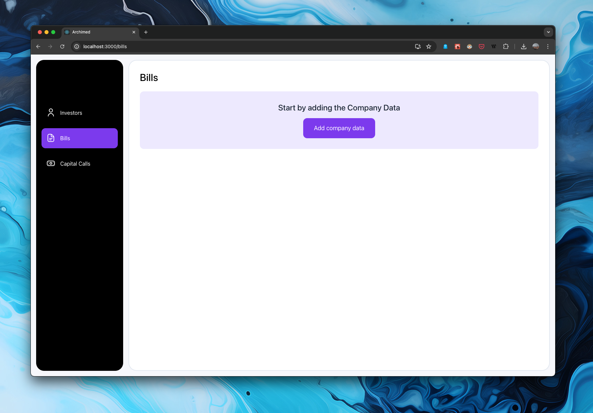
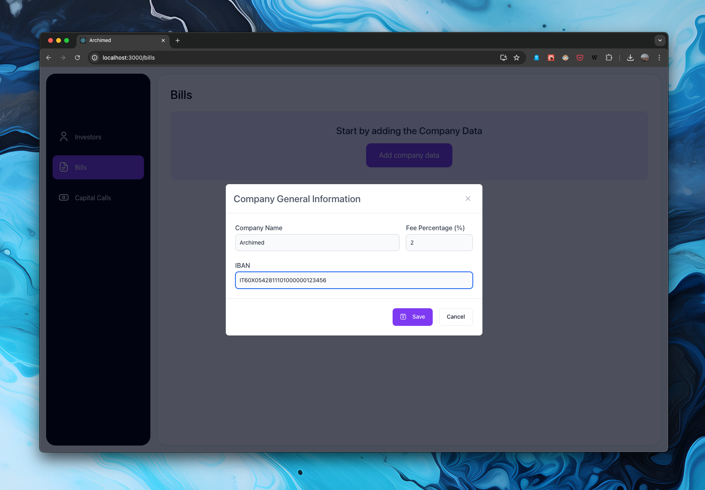
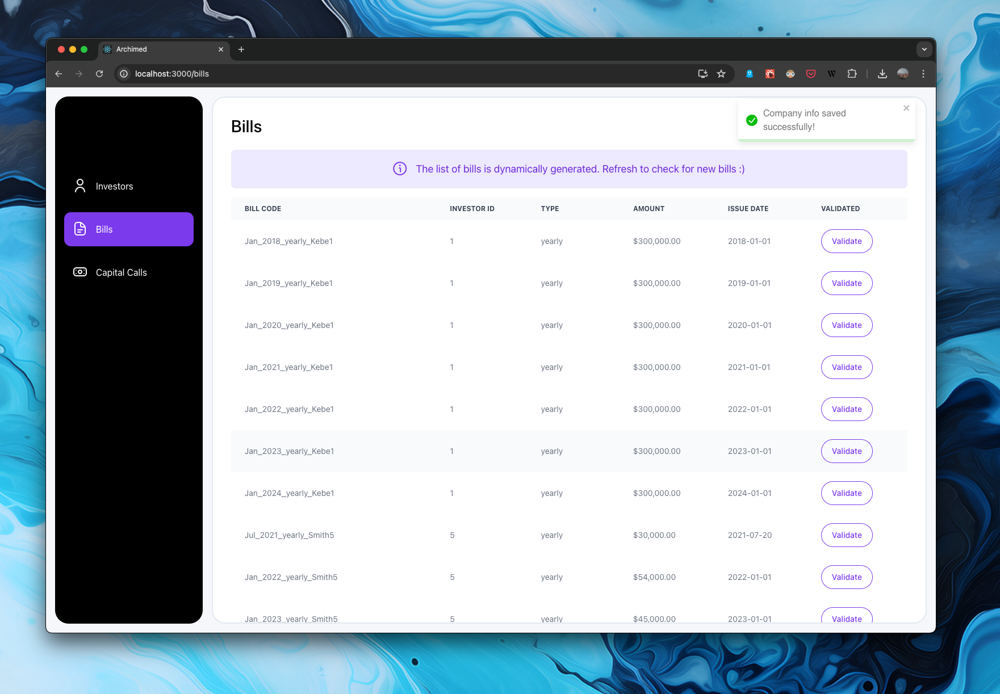
Once the company information have been set up, the bills are generated accordingly.
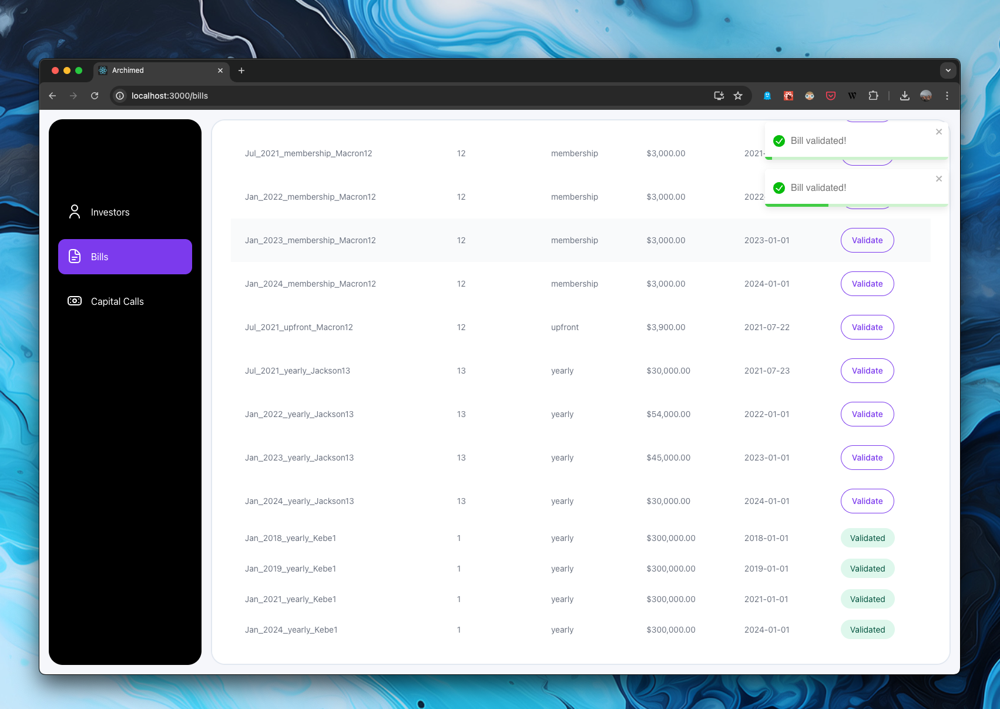
From here, we can validate bills, those ones will then be available for capital calls.

### Capital Calls Interface

On this page, we group the validated bills by investor. The user has the option to pick what bill will be part of the capital call. The generated capital call will then be featured on the section on the right hand side of this page where we display the pieces of information relevant to a capital call.
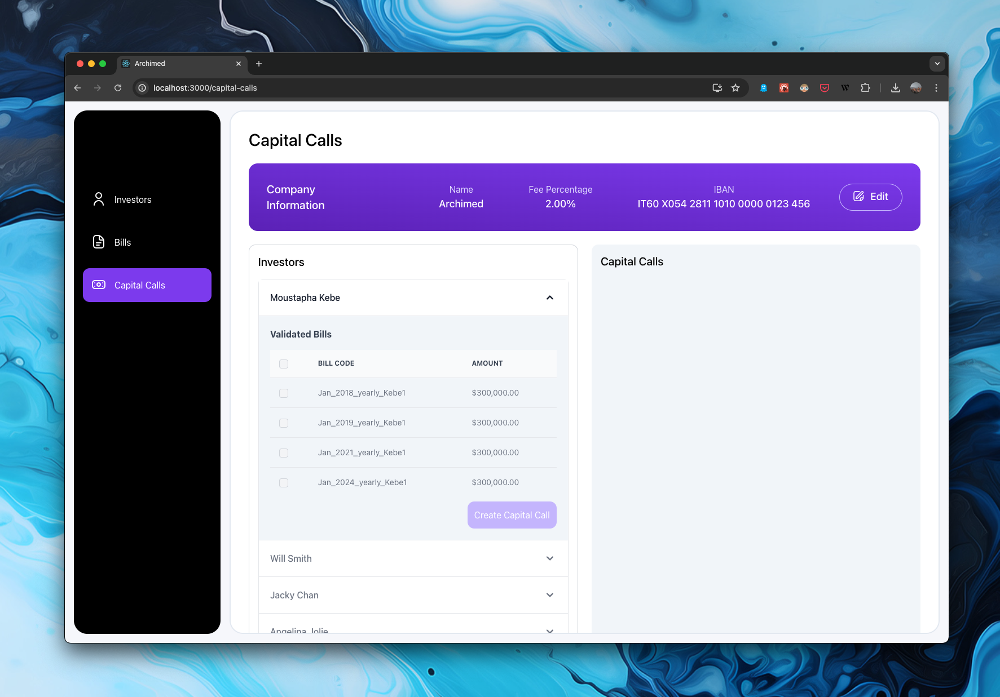
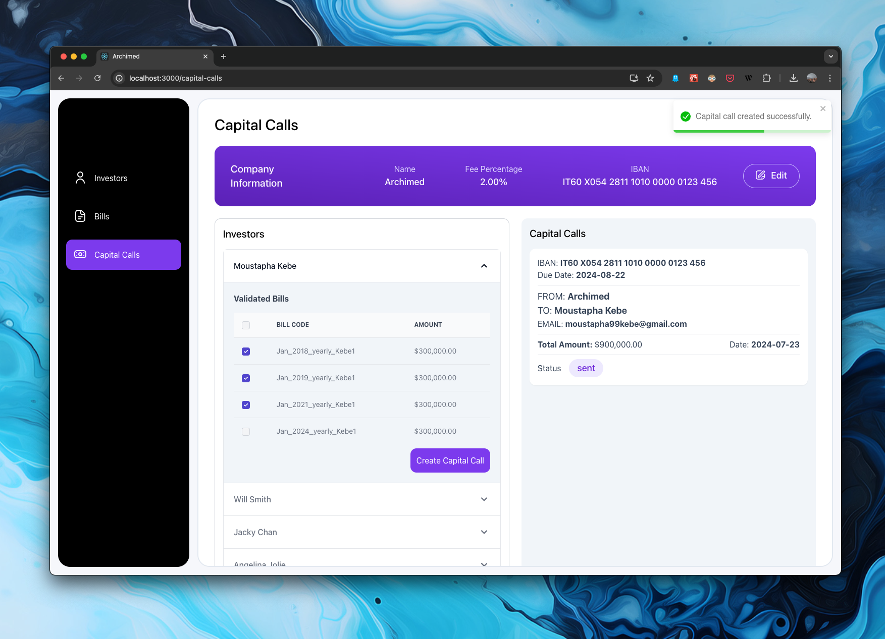
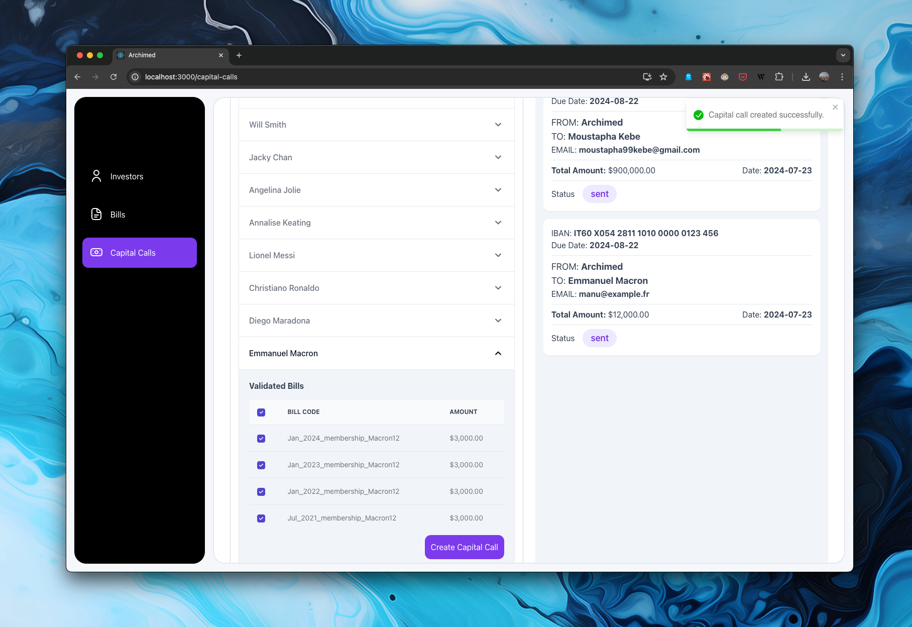

## Assumptions

### Bills Generation

- **Assumption:** Initially, there are no bills. Bills are generated automatically when the bills page is accessed. The generation of bills is based on each investor's investment amount, investment date, and the fee percentage set by the company.

### Capital Calls

- **Assumption:** A capital call is due 30 days after its issue date. This is used to determine the due date of the capital calls generated by the system.

## Installation and Setup

To run the application, you'll need to set up both the frontend (React) and backend (Django) parts of the project.

### Frontend Setup

#### 1 Navigate to the `client` directory:

```bash
cd "/client"
```

#### 2 Start the development server:

```bash
npm start
```

### Backend Setup

#### 1 Navigate to the server directory:

```bash
cd server
```

#### 2 Activate the virtual environment:

```bash
source venv/bin/activate
```

#### 3 Navigate to the backend directory:

```bash
cd backend
```

#### 4 Install the necessary Python packages:

```bash
pip install -r requirements.txt
```

#### 5 Set up the PostgreSQL database with the following credentials:

Username: postgres
Password: passer

#### 6 Run database migrations:

```bash
python manage.py migrate
```

#### 7 Start the Django development server:

```bash
python manage.py runserver
```

## Some Valid IBANs for testing purposes

The program will check whether a provided IBAN respects the IBAN ISO norms or not.
Here are some valid IBANs to be used for testing purposes
Germany (DE): DE89370400440532013000
United Kingdom (GB): GB82WEST12345698765432
France (FR): FR1420041010050500013M02606
Spain (ES): ES9121000418450200051332
Italy (IT): IT60X0542811101000000123456
Netherlands (NL): NL91ABNA0417164300
