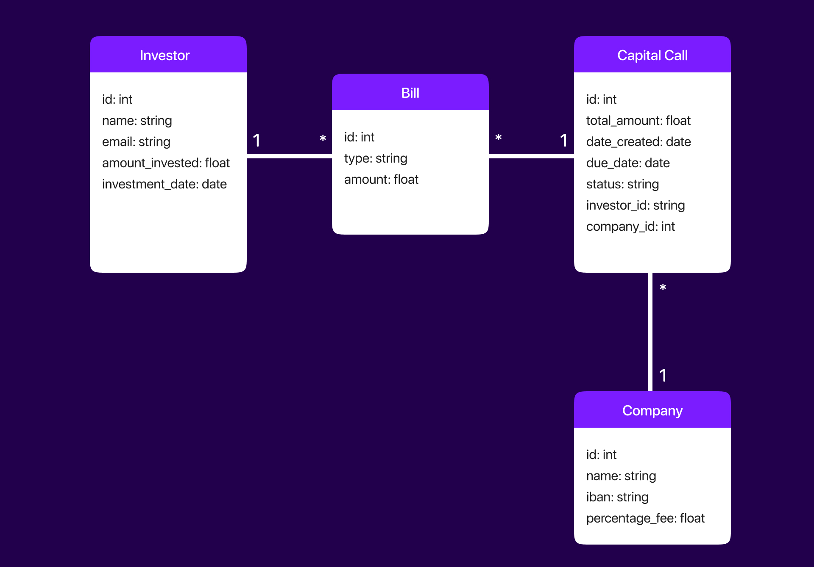

# Archimed Full Stack Developer Case Study

## Overview

This project is designed to automate the process of sending capital call invoices to investors for ARCHIMED, a healthcare private equity company. The project consists of a React frontend, a Django backend, and a PostgreSQL database. The main features include managing investors, generating bills, and creating capital calls based on specific business rules.

## Technologies Used

- **Frontend:** React with TailwindCSS for styling.
- **Backend:** Django REST Framework.
- **Database:** PostgreSQL.

## Data Structure

Here's a UML Class diagram that represents how the different entities of our system interact with each other.



## Screenshots

## Assumptions

### Bills Generation

- **Assumption:** Initially, there are no bills. Bills are generated automatically when the bills page is accessed. The generation of bills is based on each investor's investment amount, investment date, and the fee percentage set by the company.

### Capital Calls

- **Assumption:** A capital call is due 30 days after its issue date. This is used to determine the due date of the capital calls generated by the system.

## Installation and Setup

To run the application, you'll need to set up both the frontend (React) and backend (Django) parts of the project.

### Frontend Setup

#### 1 Navigate to the `client` directory:

```bash
cd "/client"
```

#### 2 Start the development server:

```bash
npm start
```

### Backend Setup

#### 1 Navigate to the server directory:

```bash
cd server
```

#### 2 Activate the virtual environment:

```bash
source venv/bin/activate
```

#### 3 Navigate to the backend directory:

```bash
cd backend
```

#### 4 Install the necessary Python packages:

```bash
pip install -r requirements.txt
```

#### 5 Set up the PostgreSQL database with the following credentials:

Username: postgres
Password: passer

#### 6 Run database migrations:

```bash
python manage.py migrate
```

#### 7 Start the Django development server:

```bash
python manage.py runserver
```
